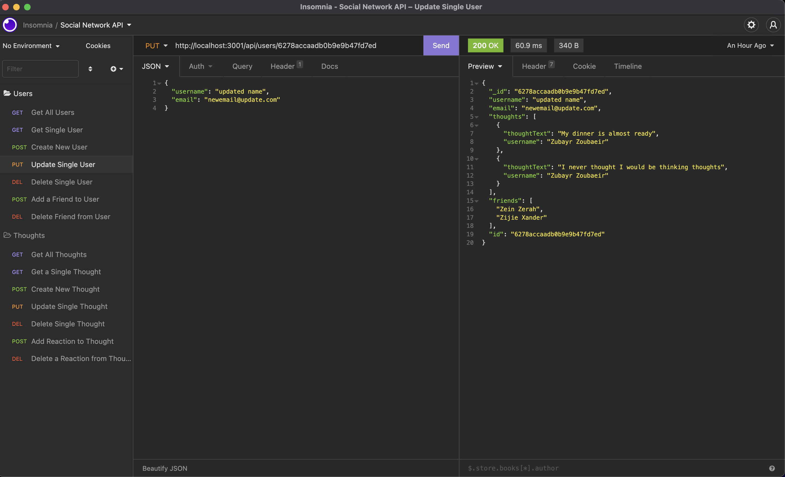

# Social Network API

  
   
   
  
  This is a backend application built using NodeJS, Express, and MongDB/Mongoose. It provides the ability to add, update, and delete users, as well as add and remove friends from users. It also provides the capability to create thoughts that are associated to a given user, to which reactions can be added or removed.

  [Video Walkthrough](https://youtu.be/fmSY1wsmABc)
   
   

  

  ##### Table of Contents  
  [How to Install](#installation)  
  [Usage](#usage)   
  [How to Contribute](#contribution)  
  [Contact](#contact)  
   

  

  ## How to Install
  Clone the repo from GitHub and run 'npm i' in the root directory.
   
   

  

  ## Usage
  Be sure to run 'npm i', then if you'd like, you can seed the database by running 'npm run seed' before starting the application.
   
   

  

  ## How to Contribute
  Asked to be added as collaborator andf then submit a pull request!
   
   

  

  ## Contact
  If you have any questions, contact the administrator at:

  * [n-r-martin](github.com/n-r-martin)
  * hello@nickmartin.design
  